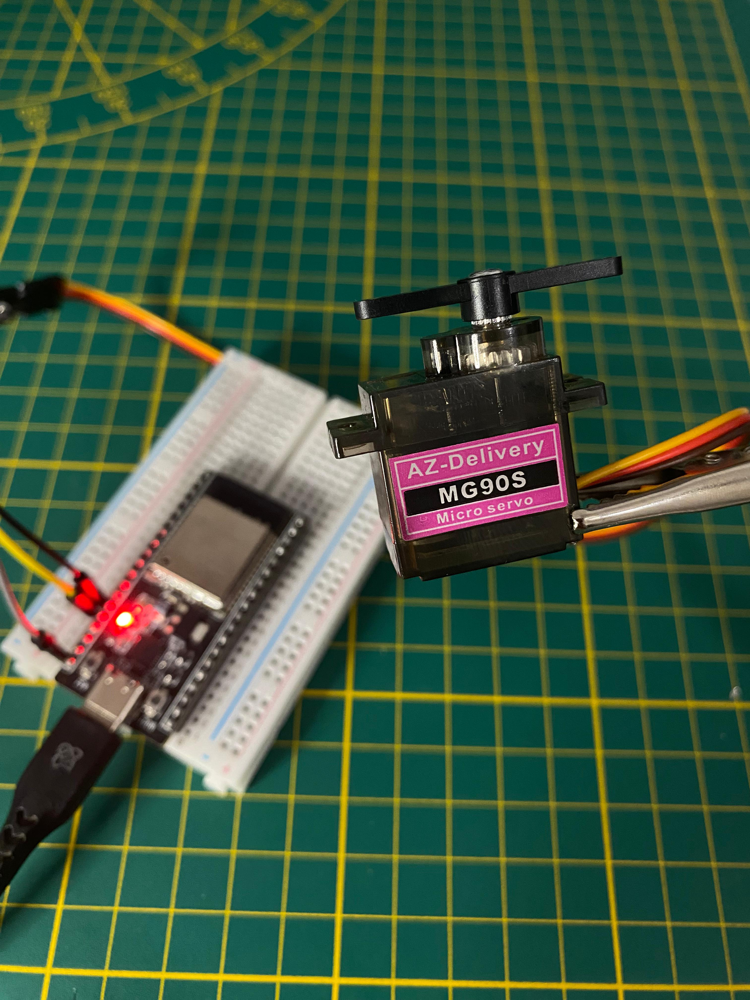

# Serial Controlled Servo (ESP32)

  

---

## Project Info
- **Project Name** : Serial Controlled Servo  
- **Version**      : 1.0  
- **Board**        : ESP32 DevKit v1  
- **File**         : `1-Serial_Servo.ino`  
- **Author**       : [JustElectronicX (Dhaivat Joshi)](https://linktr.ee/justelectronicx)  
- **Status**       : ✅ Working (tested with ESP32 + MG90S servo)  

---

## Description
This project demonstrates how to control a **servo motor** via the **Arduino IDE Serial Monitor**.  
You can enter any angle (0–180) in the Serial Monitor, and the servo immediately rotates to that position.  

Useful for:
- Robotics
- Pan-Tilt mechanisms
- Testing servo response
- DIY projects

---

## ⚡ Features
- Input servo angle (0–180) via Serial Monitor.  
- Servo position feedback printed back on Serial.  
- Input validation (rejects invalid values).  
- Works with most hobby servos.  

---

## Circuit Connections

**ESP32 → Servo Motor**

| Servo Pin | Wire Color (typical) | ESP32 Pin |
|-----------|----------------------|------------|
| VCC       | Red                  | 5V (external supply recommended) |
| GND       | Brown/Black          | GND (must be common with ESP32 GND) |
| Signal    | Orange/Yellow        | GPIO13 |

💡 **Tip:** Use an **external 5V supply** if the servo draws more current than the ESP32’s onboard regulator can provide.

---

## How to Run
1. Connect servo as per the circuit diagram.  
2. Open **Arduino IDE** → Select Board: `ESP32 Dev Module`.  
3. Upload the sketch `Serial_Servo.ino`.  
4. Open **Serial Monitor** (`Ctrl + Shift + M`).  
5. Set **baud rate** = `115200`.  
6. Type a number between `0` and `180` → Press Enter.  
7. Servo rotates and prints feedback in Serial Monitor.  

---

## ⚠️ Common Errors & Fixes
- **Servo jitters / resets**  
  → Use a separate 5V supply for the servo.  
  → Connect **ESP32 GND** and **Servo GND** together.  

- **Random "0" angle input**  
  → Set Serial Monitor to **"No line ending"** (or keep code filtering enabled).  

- **Servo not moving**  
  → Check wiring (signal must go to GPIO13).  
  → Ensure servo has enough current.  

---

## Dependencies
- [Arduino core for ESP32](https://github.com/espressif/arduino-esp32)  
- [ESP32Servo library](https://github.com/madhephaestus/ESP32Servo)  

---

## Author & Credits
- **Author** : Dhaivat Joshi (JustElectronicX)  
- **GitHub** : [Dhaivatjoshi](https://github.com/JustElectronicX)  
- **Instagram** : [@justelectronicx](https://www.instagram.com/justelectronicx)  
- **YouTube** : [JustElectronicX](https://www.youtube.com/@justelectronicx)  
- **Linktree** : [linktr.ee/justelectronicx](https://linktr.ee/justelectronicx)  

---

## 📝 Additional Notes
- Change `servoPin` in code if using another GPIO.  
- Supports SG90, MG90S, and similar hobby servos.  
- Best for beginners learning **ESP32 + Servo basics**.  

---
